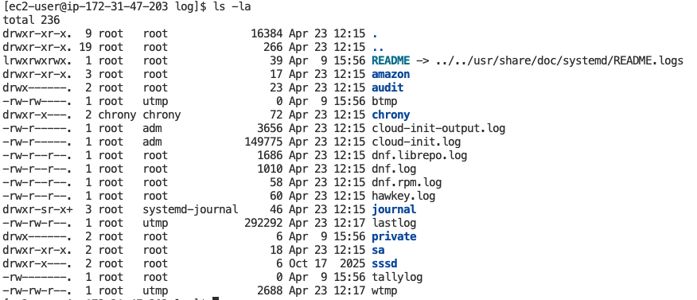
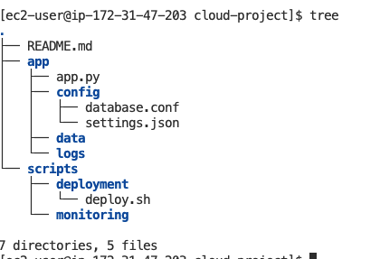
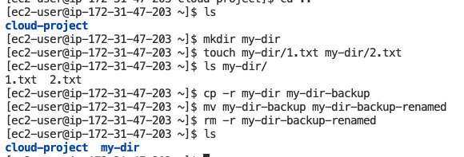
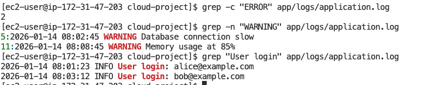
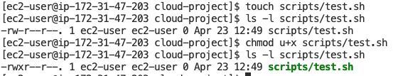
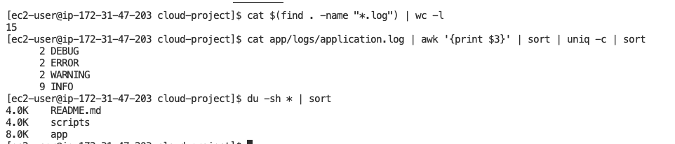
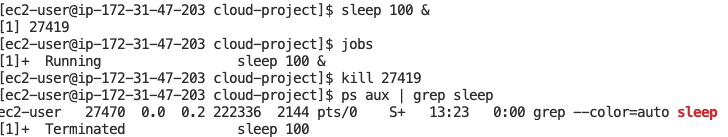
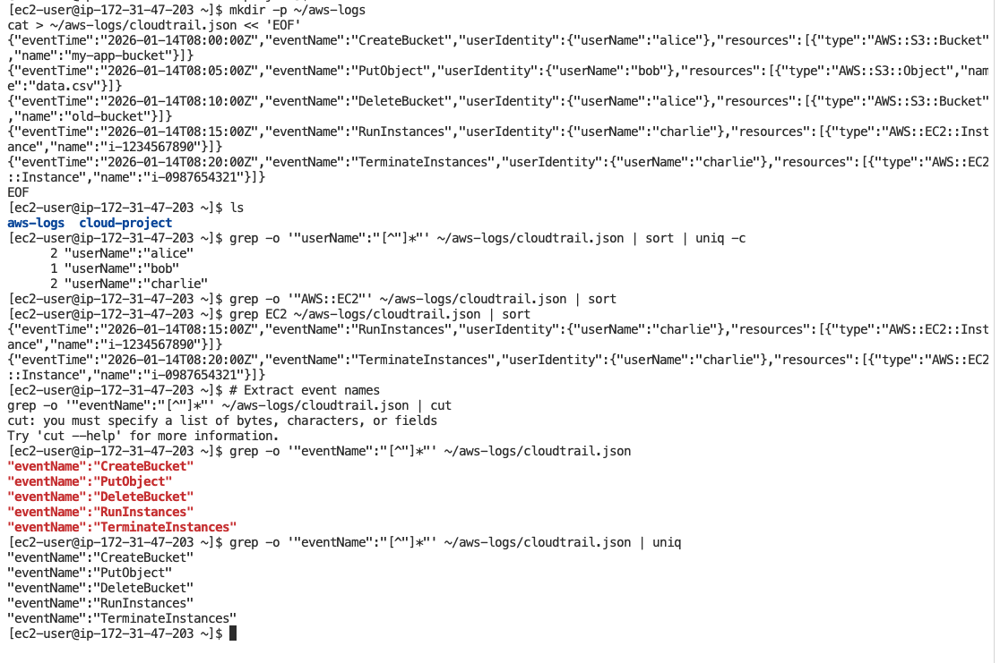
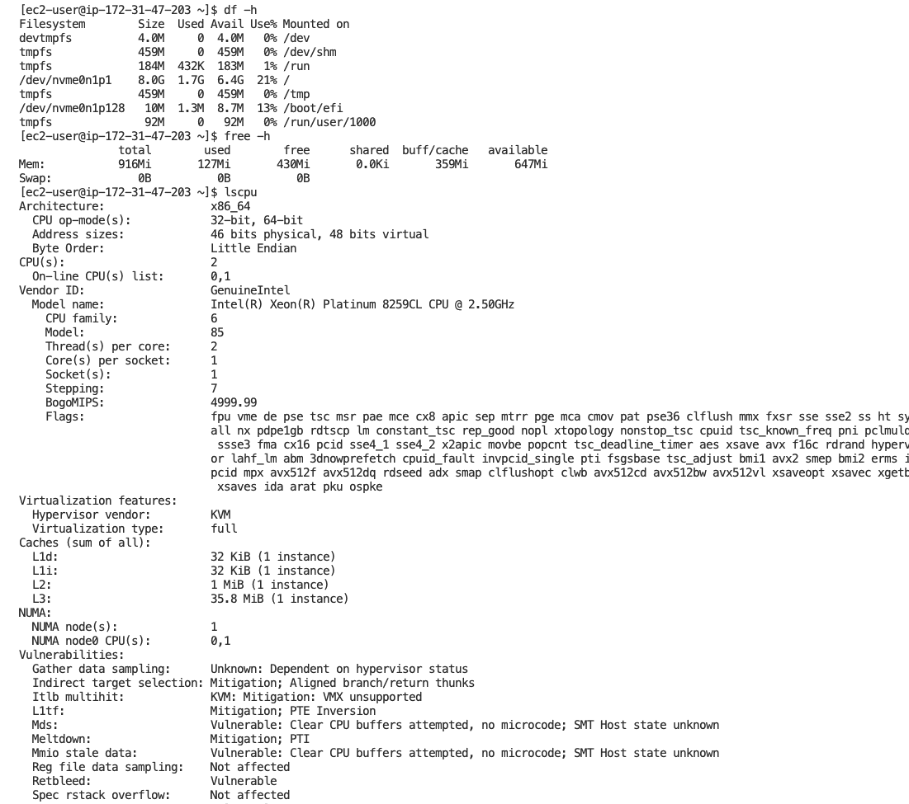

# Lab Solution: Linux Command Line Essentials

**Student Name:** Mos  
**Date:** 23.04.2026  
**Environment Used:** x EC2 ☐ Local Linux ☐ WSL ☐ macOS ☐ Cloud9

---

## Part 1: Environment Setup

### Connection Information

**Command used to connect:**
```bash
ssh -i "bootcamp-kp.pem" ec2-user@34.235.113.93
```

**Output of `whoami`:**
```
ec2-user
```

**Output of `pwd`:**
```
/home/ec2-user
```

**Output of `uname -a`:**
```
Linux ip-172-31-47-203.ec2.internal 6.1.166-197.305.amzn2023.x86_64 #1 SMP PREEMPT_DYNAMIC Mon Mar 23 09:53:26 UTC 2026 x86_64 x86_64 x86_64 GNU/Linux
```

---

## Part 2: Navigation Practice

### Task: Navigate to /var/log and back

**Commands executed:**
```bash
# Navigate to /var/log
cd /var/log

# List contents
ls -la

# Return to home directory
cd ~
```

**Screenshot 1: /var/log directory listing**


---

## Part 3: Directory Structure Creation

### Project Structure

**Commands to create directory structure:**
```bash
# Create cloud-project directory
mkdir cloud-project

# Create nested directories
mkdir -p app/config
mkdir -p app/logs
mkdir -p app/data
mkdir -p scripts/deployment
mkdir -p scripts/monitoring

# Create files
touch app/app.py
touch app/config/settings.json
touch app/config/database.conf
touch scripts/deployment/deploy.sh
touch README.md


# Add content to files

echo "# Cloud Project" > README.md
echo "This is a sample cloud application." >> README.md

cat > app/app.py << 'EOF'
#!/usr/bin/env python3
# Simple cloud application
print("Hello from the cloud!")
EOF
```

**Screenshot 2: Project structure (tree or ls -R output)**


---

## Part 4: File Operations

### Copy, Move, Delete Practice

**Commands for test directory task:**
```bash
# Create test directory with files
mkdir my-dir
touch my-dir/1.txt my-dir/2.txt

# Make backup copy
cp -r my-dir my-dir-backup

# Rename backup
mv my-dir-backup my-dir-backup-renamed

# Delete backup
rm -r my-dir-backup-renamed

# Verify final state
ls
```

**Screenshot 3: File operations results**


---

## Part 5: Viewing File Contents

### Log File Analysis

**Output of last 3 lines:**
```
2026-01-14 08:15:30 INFO Backup completed successfully
2026-01-14 08:20:00 DEBUG Garbage collection triggered
2026-01-14 08:25:15 INFO Health check: OK
```

**Command used:**
```bash
tail -n 3 app/logs/application.log
```

---

## Part 6: Searching with grep

### Task: Search log file

**1. Count ERROR messages:**
```bash
# Command:
grep "ERROR" app/logs/application.log
# Output:
2
```

**2. Find WARNING messages with line numbers:**
```bash
# Command:
grep -n "WARNING" app/logs/application.log
# Output:
5:2026-01-14 08:02:45 WARNING Database connection slow
11:2026-01-14 08:08:45 WARNING Memory usage at 85%
```

**3. Extract user login events:**
```bash
# Command:
grep "User login" app/logs/application.log
# Output:
2026-01-14 08:01:23 INFO User login: alice@example.com
2026-01-14 08:03:12 INFO User login: bob@example.com
```

**Screenshot 4: grep search results**


---

## Part 7: File Permissions

### Task: Create and secure script

**Commands executed:**
```bash
# Create test script
touch scripts/test.sh

# Check initial permissions
ls -l scripts/test.sh

# Make executable for owner only
hmod u+x scripts/test.sh

# Verify permissions
ls -l scripts/test.sh
```

**Initial permissions:** -rw-r--r--. 1 ec2-user ec2-user 0 Apr 23 12:49 scripts/test.sh

**Final permissions:** -rwxr--r--. 1 ec2-user ec2-user 0 Apr 23 12:49 scripts/test.sh

**Screenshot 5: Permission changes**


### Secure Backup Script

**Script content:**
```bash
#!/bin/bash
echo "Creating backup..."
cp $1 "$1.backup"
echo "Backup created successfully."
```

**Permissions set:**
```bash
# Command:
chmod 744 scripts/backup.sh 
# Result (ls -l):
-rwxr--r--. 1 ec2-user ec2-user 92 Apr 23 13:07 scripts/backup.sh
```

---

## Part 8: Pipes and Redirects

### Task: Command chaining

**1. Count total lines in all .log files:**
```bash
# Command:
cat $(find . -name "*.log") | wc -l
# Result:
15
```

**2. Find unique log levels and count:**
```bash
# Command:
cat app/logs/application.log | awk '{print $3}' | sort | uniq -c | sort
# Result:
2 DEBUG
2 ERROR
2 WARNING
9 INFO
```

**3. List files sorted by size:**
```bash
# Command:
du -sh * | sort
# Result:
4.0K    README.md
4.0K    scripts
8.0K    app
```

**Screenshot 6: Pipes and redirects output**


---

## Part 9: Process Management

### Task: Background process

**1. Start long-running command in background:**
```bash
# Command:
sleep 100 &
# Output (job number):
[1] 27419
```

**2. List all jobs:**
```bash
# Command:
jobs
# Output:
[1]+  Running                 sleep 100 &
```

**3. Kill the process:**
```bash
# Command:
kill 27419
# Verification:
ps aux | grep sleep
[1]+  Terminated              sleep 100
```

**Screenshot 7: Process management**


---

## Part 10: Cloud Engineering Scenarios

### CloudTrail Log Analysis

**1. Events per user:**
```bash
# Command:
grep -o '"userName":"[^"]*"' ~/aws-logs/cloudtrail.json | sort | uniq -c
# Result:
2 "userName":"alice"
1 "userName":"bob"
2 "userName":"charlie"
```

**2. EC2 operations:**
```bash
# Command:
grep EC2 ~/aws-logs/cloudtrail.json | sort
# Result:
{"eventTime":"2026-01-14T08:15:00Z","eventName":"RunInstances","userIdentity":{"userName":"charlie"},"resources":[{"type":"AWS::EC2::Instance","name":"i-1234567890"}]}
{"eventTime":"2026-01-14T08:20:00Z","eventName":"TerminateInstances","userIdentity":{"userName":"charlie"},"resources":[{"type":"AWS::EC2::Instance","name":"i-0987654321"}]}
```

**3. Unique event types:**
```bash
# Command:
grep -o '"eventName":"[^"]*"' ~/aws-logs/cloudtrail.json | uniq
# Result:
"eventName":"CreateBucket"
"eventName":"PutObject"
"eventName":"DeleteBucket"
"eventName":"RunInstances"
"eventName":"TerminateInstances"
```

**Screenshot 8: CloudTrail analysis**


### System Monitoring

**1. Disk space:**
```bash
# Command: df -h

# Total space: 8.0G
# Used: 1.7G
# Available: 6.4G
# Usage %: 21%
```

**2. Available memory:**
```bash
# Command: free -h

# Total: 916Mi
# Used: 127Mi
# Free: 430Mi
```

**3. CPU cores:**
```bash
# Command: lscpu

# CPU(s): 2
# Model: Intel(R) Xeon(R) Platinum 8259CL CPU @ 2.50GHz
```

**Screenshot 9: System resources**


---

## Command Cheat Sheet (Your Most Used)

**List your 10 most-used commands from this lab:**

1. `cd` 
2. `ls` 
3. `mkdir` 
4. `touch` 
5. `cp` 
6. `mv` 
7. `rm` 
8. `tail` 
9. `grep` 
10. `chmod` 

---

## Reflection Questions

### 1. How do file permissions enhance security in cloud environments?

**Your answer:**
```
File permissions enforce least privilege access to files and scripts.
They help prevent unauthorized users or processes from reading secrets,
changing configs, or executing sensitive automation on shared systems.
```

### 2. Why is piping commands together more efficient than intermediate files?

**Your answer:**
```
Pipes pass output directly from one command to the next in memory. That avoids creating temporary files.
```

### 3. Describe a real-world scenario where you'd use `tail -f`.

**Your answer:**
```
I would use tail -f during an application deployment on an EC2 server
to watch the live log file for startup errors or docker logs.
```

### 4. What's the difference between killing with `kill` vs `kill -9`?

**Your answer:**
```
"kill" sends SIGTERM, which asks the process to stop gracefully and letsit clean up resources. 
"kill -9" sends SIGKILL, which forces an immediate stop and should be used only when the process is stuck.
```

### 5. How does Linux CLI proficiency help with AWS CLI usage?

**Your answer:**
```
AWS CLI work depends on the same skills used in Linux cli, for exmaple 
navigating directories, using pipes, searching and filtering output.
It makes loud operations faster and easier to debug.
```

---

## Troubleshooting Log

**Did you encounter any issues?** (Yes/No): ______

**If yes, document:**

| Issue | Commands Tried | Solution | Time Spent |
|-------|---------------|----------|------------|
|       |               |          |            |
|       |               |          |            |
|       |               |          |            |

---

## Cleanup Confirmation

- [x] Removed ~/cloud-project directory
- [x] Removed ~/aws-logs directory
- [x] Verified no leftover files

**Cleanup commands:**
```bash
rm -r ~/cloud-project
rm -r ~/aws-logs
```

---

## Self-Assessment

**Rate your confidence (1-5, where 5 is expert):**

| Skill | Before Lab | After Lab | Notes |
|-------|-----------|-----------|-------|
| Filesystem navigation | 4/5 | 5/5 | |
| File manipulation | 3/5 | 4/5 | |
| Viewing/searching files | 3/5 | 4/5 | |
| File permissions | 4/5 | 5/5 | |
| Pipes and redirects | 3/5 | 4/5 | |
| Process management | 2/5 | 3/5 | |
| Log analysis | 4/5 | 5/5 | |

---

## Bonus Challenges Completed

- [ ] Explored `awk` for text processing
- [ ] Created a shell script with multiple commands
- [ ] Used `find` with complex criteria
- [ ] Practiced `sed` for text replacement
- [ ] Set up custom bash aliases

**Bonus notes:**
```
_____________________________________________________________
_____________________________________________________________
_____________________________________________________________
```

---

## Instructor Verification

**Instructor Name:** ___________________________

**Date Reviewed:** ___________________________

**All tasks completed:** ☐ Yes ☐ No

**Comments:**
```
_____________________________________________________________
_____________________________________________________________
_____________________________________________________________
```

**Grade/Status:** ___________________________

---

**Lab Status:** ☐ Complete ☐ Needs Revision

**Total Time Spent:** ________ minutes

**Submission Date:** ___________________________
